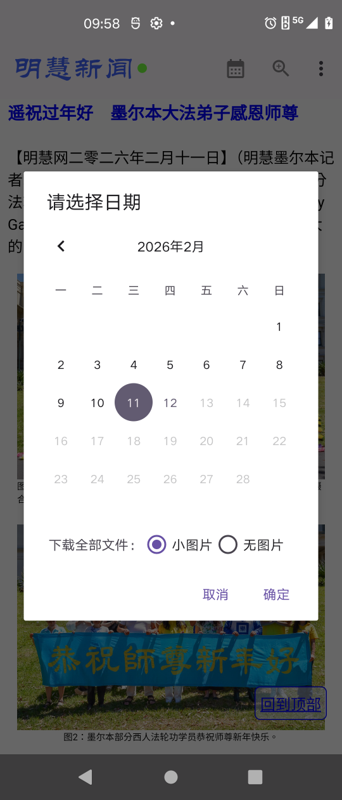
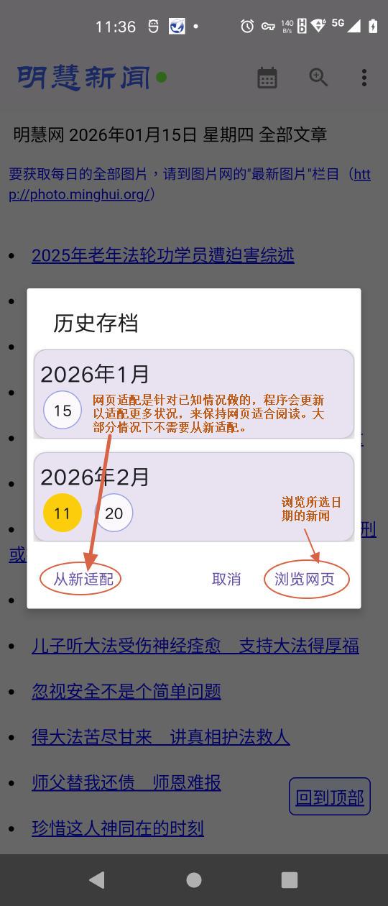
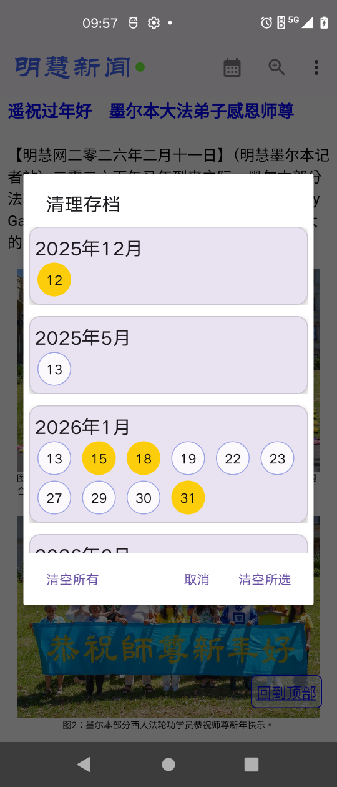
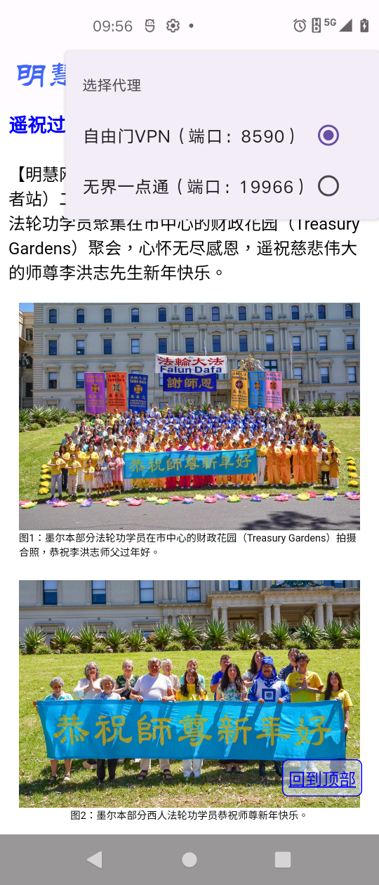
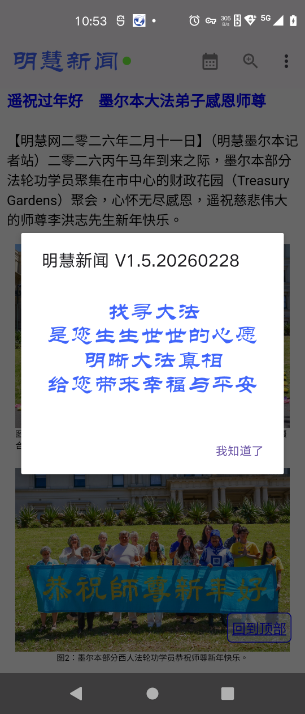

# “明慧新聞”使用簡要説明

## 一、程序簡介

本程序以移動版明慧网（m.minghui.org）提供的每日新聞壓縮文件（小圖或無圖）為資料源，充分利用壓縮文件體積小、下载速度快的優勢，同时藉助Android版自由門VPN或無界一點通具備的代理功能，提供了相應的下載、解壓、手機或平板等移動設備端網頁適配以及顯示的一個流程完整且使用安全的功能。详细功能如下：
1.	所有的網絡訪問通過代理實現，無直連之憂，因此無安全疑慮。在此基礎上，提供了安全的離綫瀏覽功能。
2.	針對使用設備，手機或平板的顯示，做了適配，並提供了黑夜和白天兩種主題，以及網頁字體大小調整的方便功能。
3.	對於有圖資源，網頁可以顯示和放大圖片，联网且有代理情况下可播放部分視頻（油管的視頻不支持），如明慧站内的mp4等視頻文件，且視頻可全屏觀看。
4.	網頁的鏈接，除視頻之外，其它鏈接，如下載，都暫不支持。
5.	提供瀏覽后的網頁資料的歸檔，以備今後離綫瀏覽。 
6.	提供歸檔歷史的清理功能。
雖然翻墻總是不易也不一定穩定，但是程序提供的下載和歸檔功能，能善用成功翻墻的短暫時間，提供給世人一個後續可以完整的甚至圖文並茂的每日明慧新聞，讓人們有機會全面瞭解大法真相，以給自己選擇美好的未來。

 
## 二、開發環境等

|  類別  |說明|
| :---   | :---        |
|開發工具	|Android Studio 2025.3.1|
|語言|Kotlin|
|适合的Android系统|7.0+|
|官方库之外引用的庫|zip4j, jsoup, subsampling.scale.image.view, coil, volley|

## 三、使用簡要說明

### （一）程序界面介紹

1、程序界面及部分菜單

2、其餘菜單

3、根據日曆選擇瀏覽日期

4、調整網頁文字大小

5、從歷史文檔中選擇瀏覽	

6、清理歷史歸檔

7、切換主題菜單

8、代理選擇菜單

9、關於

10、夜間模式

11、點擊圖片后狀態1

12、點擊圖片后狀態2

13、視頻播放

14、視頻全屏播放

### （二）注意事項

## 四、程序願望

望您瞭解大法真相，愿您未來光明而美好！

